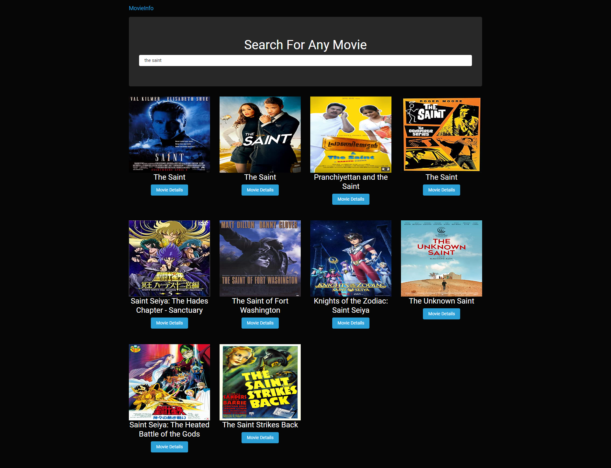
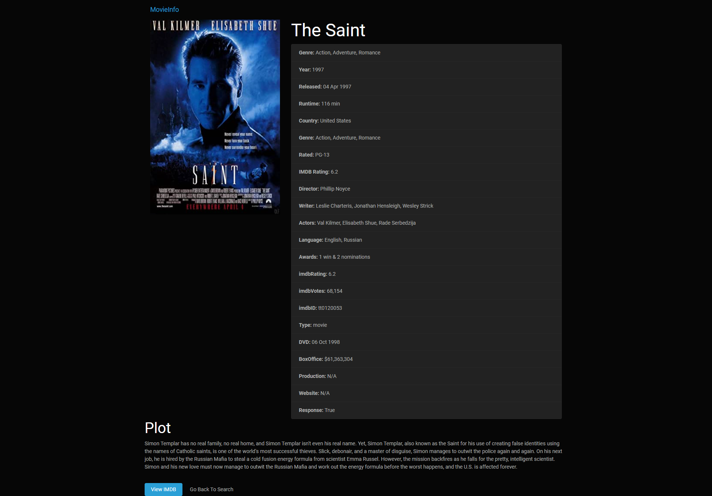

<h1 align="center">Movie Info App</h1>

# Table of Contents

JavaScript/jQuery app that fetches movie data from the [OMDb API](https://www.omdbapi.com/)

## Instructions

- Open index.html
- `composer.json` and `index.php` are included for static hosting on heroku using Composer PHP buildpack.

<h1 align="center">

</h1>

